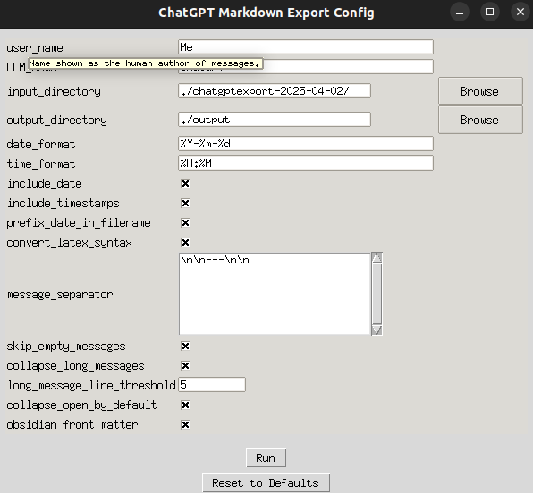

# ChatGPT4o Conversation Exporter 📝

This tool converts exported ChatGPT (e.g., GPT-4o) conversations into clean, structured Markdown files.  
It supports:

- ✅ Proper Markdown and LaTeX formatting
- ✅ Collapsible long messages
- ✅ Embedded image rendering for both generated and user-provided images
- ✅ YAML frontmatter (for Obsidian)
- ✅ Date and timestamps
- ✅ GUI-based configuration and one-click export

> ⚠️ Designed primarily for ChatGPT-4o.  
> Researched responses from GPT-4o may not format well, and models like o1/o3 with advanced reasoning capabilities are currently not formatted correctly.

---

## 🖼️ GUI Screenshot


---

## 🚀 Usage Instructions

1. **Export your ChatGPT conversations** from [chat.openai.com](https://chat.openai.com) as a JSON archive. Depending on the OpenAI servers, this may take a while.
2. Extract the contents into a folder (e.g., `./chatgptexport`).
3. Make sure to have installed Pythono 3.7 or higher and run the GUI:

   ```bash
   python gui.py
   ```

4. Adjust settings in the GUI (input/output folders, formatting options, etc.).
5. Click **Run** to generate `.md` files in the output directory.

---

## 📂 Example Output

See [`example.md`](./example.md) for a sample Markdown file generated from a ChatGPT conversation.  
Includes code blocks, timestamps, and inline images.

---

## 🛠️ Requirements

- Python 3.7 or higher
- No external dependencies (uses only built-in libraries)

---

## 📌 Notes

- Images are extracted and embedded using `` HTML tags for compatibility with Obsidian and most Markdown renderers.
- LaTeX syntax like `\\( ... \\)` and `\\[ ... \\]` is optionally auto-converted to `$...$` and `$$...$$` for correct rendering.
- You can reset the configuration via the **Reset** button in the GUI.
- This repo was intialized as a copy of https://github.com/daugaard47/ChatGPT_Conversations_To_Markdown